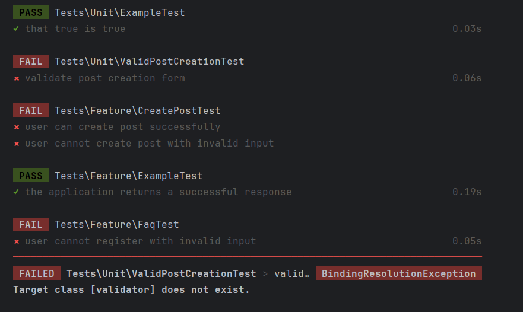

# Project-name

Laravel Skeleton App. Base project for all HZ-HBO-ICT Laravel projects.

## Features

This repository contains the following features
* Holds the 'this is the version we work with for this year'
* Custom workflow action based on PHPCodeSniffer. Checks codestyle rules relevant for our Laravel based courses and exams
* Customized `.gitignore` that ignores files and folders specific for our supported IDEs
* Customizable Bulma integration
* Font-awesome integration
* Removed all references to Tailwind in the views
* Basic tests

## Usage

The intended use of this project is to fork it. Forked projects can develop specific features. Before the start of each
course instance, this project can be updated with the latest Laravel version. When this is done, the forked projects
can pull these updates into their own codebase.

## Developing

### Upgrade to the latest Laravel version

The simplest way that ensures all the files are as close to a fresh installation as possible is:

1. Clone this repository
2. Create a branch `update-to-laravel-##.##` (##.## should equal the laravel version in question)
3. Create a fresh Laravel installation alongside the clone
4. Check `.gitignore` and migrate possible new rules in a version specific section inder 'Laravel'
5. Copy-paste the added features (see features chapter) into the new app
6. Check code style and test functionality
7. Empty the cloned repo folder (leave the `.git` folder of course)
8. Copy the content of the new app into the repository folder
9. Commit with a message: `Upgrade to Laravel ##.##` (##.## should equal the laravel version in question) and push

## Authors

* **Daan de Waard** - *Initial work* - [dwaard](https://github.com/dwaard)

See also the list of [contributors](https://github.com/HZ-HBO-ICT/laravel-skeleton-app/graphs/contributors) who
participated in this project.

## Acknowledgements

The layout of this app is heavily inspired by the [Bulma clean theme](http://www.csrhymes.com/bulma-clean-theme/). We
thank the author [C.S. Rhymes](https://www.csrhymes.com/) for this.

The installation instructions in this file are based on [DevMarketers](https://devmarketer.io/learn/author/devmarketer/)
outstanding article [How to Setup a Laravel Project You Cloned from Github.com](https://devmarketer.io/learn/setup-laravel-project-cloned-github-com/)

## Licensing

The code in this project is licensed under MIT license.

THE TESTING DOCUMENTATION
Testing- IT Development Portfolio

User Stories and Tests
User story: FAQ Registration
As an admin, I want to register FAQs successfully with valid inputs so that users can see correct information on the FAQ Page.
It is accepted when:
•	The admin can register an FAQ with valid question, answer and link.
•	System displays an error message for invalid inputs.

Test Plan:
System Test
Happy Path:
Verify that an FAQ can be registered successfully with valid inputs.
Unhappy Path:
Verify that the system displays appropriate error messages for invalid inputs.

Unit Test:
Test the function that validates FAQ input data.
Evaluation
Possible Mistake/ Error Detected by tests
•	The tests can detect issues such as incorrect handling of form submissions, improper validation logic and database-related errors such as missing or incorrect entries.
Possible mistake/ Error not detected by tests
•	The tests might not detect user interface issues. Additionally, they might not catch errors related to concurrent access or integration with other systems.
Extent Of Correct Functionality
The tests provide confidence that the specific functionalities described in the user stories work correctly, including the validation logic and database interactions.
However, they do not cover all possible scenarios. Comprehensive testing that also includes integration test and performance tests., is necessary to ensure the system works correctly in all aspects.

User story: Create a post
As a user, I want to create a new post so that I can share my thoughts with others.
It is accepted when:
•	User can successfully create a post with a valid title and content.
•	System displays an error when trying to create a post without a title.

Test Plan:
System Test
Happy Path:
User can create post successfully.
Unhappy Path:
User cannot create post with invalid input.

Unit Test:
It validates the title and content and provides various input to ensure it correctly validates valid and invalid data.

Evaluation
Possible Mistake/ Error Detected by tests
•	The tests can detect if the system fails to create a post when the title is missing.
•	The test can also identify if a post is incorrectly added to the database despite invalid input.
Possible mistake/ Error not detected by tests
•	The tests might not detect performance issues such as slow database transactions.

Extent Of Correct Functionality
These tests confirms that the post creation functionality works for the provided scenarios.
 
THE SCREENSHOT

